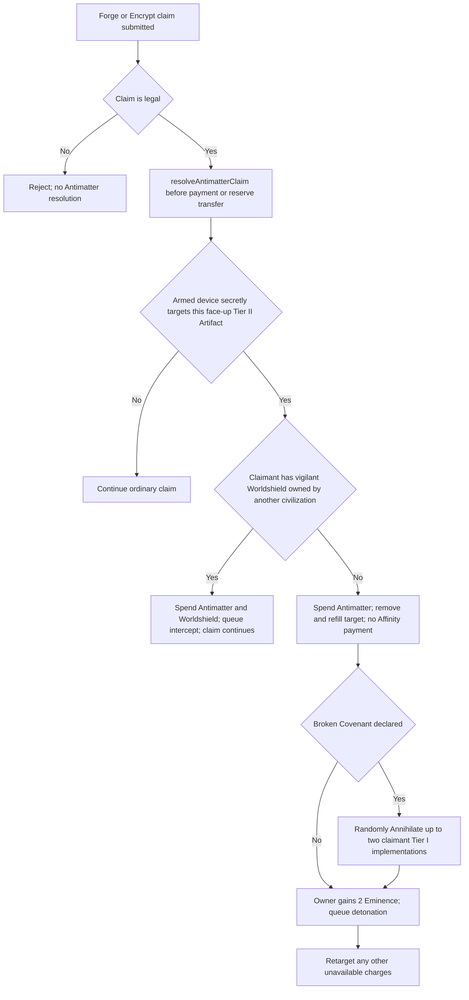

# LUMINAe Civilization Blueprint Metadata Audit v1.0

## Audit Identity

- Repository: `/Users/chaoscalligraphy/.codex/worktrees/4aa4/Lumiane`
- Audited state: detached `HEAD` at `7f2a09ff08a7f325363c413963b4f5ce08eb74c2`, including the dirty worktree present on 2026-08-23 EDT
- Audit mode: static, read-only evidence inspection; no tests were executed
- Civilization authority: Civilization Layer Final Codex Audit Handoff v1.1
- Blueprint authority: `/Users/chaoscalligraphy/Documents/Lumiane/docs/LUMINAe_BLUEPRINT_FIRST_POOL_SPEC_v2.0.md` where it governs exact Blueprint rules
- Runtime authority for shipped behavior: `lib/game-types/src/index.ts`, `artifacts/api-server/src/lib/gameEngine.ts`, and `artifacts/api-server/src/routes/blueprints.ts`

The dirty worktree is current implementation evidence, not a clean release snapshot. Untracked Civilization files are included in this audit.

## Status And Confidence Legend

| Label | Meaning |
|---|---|
| `SUPPORTED` | Runtime and current canon agree on the audited point. |
| `PARTIAL` | A usable implementation exists, but required metadata, state, or behavior is incomplete. |
| `CONFLICT` | Current runtime behavior contradicts current canonical doctrine. |
| `MISSING` | Current canon specifies the Project, but the runtime has no corresponding implementation. |
| `OBSOLETE_RUNTIME` | Code or tests preserve a superseded rule. |
| `DEFERRED_BY_SPEC` | The source intentionally preserves a future concept without making it playable. |

Evidence confidence is called out as **strong source**, **partial source**, **stale source**, **runtime-only**, or **missing evidence**.

## Executive Inventory

| Project | Canon state | Runtime state | Civilization treatment | Verdict |
|---|---|---|---|---|
| Antimatter Detonator | First-pool canonical | Implemented | Authored stellar quarantine consequence | `CONFLICT` |
| Mantle-to-Orbit Foundry | First-pool canonical | Implemented with older effect | Authored planetary freight/foundry consequence | `CONFLICT` |
| Ascension Registry | First-pool canonical; Lumii challenge | Not in `BlueprintId` or runtime | None | `MISSING` |
| Worldshield Covenant | Canonical for later Campaign/Custom; excluded from Lumii opening | Implemented and included in Lumii opening | Authored planetary defense consequence | `CONFLICT` |
| 20 displaced Tier III concepts | Non-production concept vault | Not implemented | No production treatment required | `DEFERRED_BY_SPEC` |

The public type registry contains only three IDs at `lib/game-types/src/index.ts:121-127`. The canonical v2 pool contains four Projects, and specifically replaces Worldshield with Ascension in the first Lumii challenge.

## Shared Blueprint Architecture

### Current shared model

- Definitions contain ID, name, family, exact components, public effect, initial state, competitive flag, and presentation metadata: `lib/game-types/src/index.ts:250-382`.
- Owner-private assembly state records matched components, manifestation, secret target, and a pre-manifest action exception: `lib/game-types/src/index.ts:408-415`.
- Public devices expose ID, owner, slot, operational state, presentation variant, and two legacy Foundry flags: `lib/game-types/src/index.ts:417-425`.
- Manifestation and detonation events are durable in live game JSON: `lib/game-types/src/index.ts:427-460`.
- Exact forged components are checked automatically in assigned-slot order, remain forged, and create a public device plus queued presentation: `artifacts/api-server/src/lib/gameEngine.ts:1420-1475`.
- The live game is persisted as versioned JSONB, so additive live fields are technically possible: `lib/db/src/schema/gameStates.ts:5-10`.

### Hidden-information posture

**Strong source, PARTIAL.**

- Opponent private Blueprint states and private reserves are stripped by `projectGameStateForViewer`; Lumii devices/events/logs are projected as anonymous sealed protocols: `artifacts/api-server/src/lib/stateProjection.ts:141-310`.
- The dedicated projection test checks three anonymous protocol IDs and absence of private/device identity: `artifacts/api-server/src/lib/stateProjection.test.ts:205-316`.
- The Civilization builder accepts only manifested public devices and anonymous scenario protocols, and deliberately renders a sealed consequence without identity: `artifacts/luminae/src/lib/civilizationDeploymentSites.ts:968-998,1050-1075`.
- However, complete `BLUEPRINT_DEFINITIONS`, including names, recipes, and public effects, are imported into client modules such as `HorizontalBlueprintCard.tsx:11,79`, `BlueprintGamePanel.tsx:9,55`, `BlueprintPresentationOverlay.tsx:6,51`, and `civilizationDeploymentSites.ts:9,882`. Live ownership, target, and progress remain protected, but the static catalog is present in the client bundle and is therefore datamineable. This does not satisfy a strict "no inaccessible-state metadata or asset-loading leak" standard.

### Persistence posture

**Strong source, PARTIAL.**

- Per-match public/private state and events persist inside `game_states.state`.
- Account tables persist unlocks, loadouts, manifestations, triggers, and armed finishes: `lib/db/src/schema/accounts.ts:162-208`.
- Completion rolls up Blueprint mastery after non-withdrawal matches: `artifacts/api-server/src/lib/accountProgress.ts:327-467`.
- No Civilization entity lifecycle, Damage record, Project governance history, pressure tags, Stability contribution, or immutable Civilization Record is persisted.

## Antimatter Detonator

### Identity and sources

- ID: `bp_antimatter_detonator`
- Name: Antimatter Detonator
- Canon: `LUMINAe_BLUEPRINT_FIRST_POOL_SPEC_v2.0.md:24-49`
- Runtime definition: `lib/game-types/src/index.ts:277-316`
- Runtime resolution: `artifacts/api-server/src/lib/gameEngine.ts:1516-1617`
- Runtime tests inspected: `artifacts/api-server/src/lib/blueprintEngine.test.ts:196-391`

Evidence confidence: **strong source** for both canon and runtime.

### Components

| Stage | Artifact |
|---|---|
| Reaction Core | `t1r01` Ignition Kernel |
| Containment Cage | `t1p04` Magnetic Bottle |
| Governed Trigger | `t1r04` Causal Spark Coil |
| Annihilation Sink | `t2o01` Horizon Extractor |

Canon and runtime agree on the exact recipe.

### Hidden and visible state

Before manifestation, identity, recipe progress, target, and presentation variant are owner-private in server state. After manifestation, the public device exposes identity, owner, state, and presentation. The secret target remains private. Lumii projection replaces even manifested identity with a sealed protocol for the player.

Verdict: `SUPPORTED` for live state projection; `PARTIAL` because static client definitions remain inspectable.

### Manifestation, form, and scale

- Automatic exact-component manifestation: supported.
- Components retained: supported.
- Canon form/theater: Stellar Device. Canonical physical manifestation: satellite-scale.
- Runtime presentation metadata: Stellar theater, satellite manifestation scale, gimbaled-orbit motion, and dedicated manifestation and detonation treatment.
- Civilization presentation: `Antimatter Quarantine Orbit`, an opaque 2.5D satellite device inside a cold red stellar exclusion path rather than a card cutout or planet-sized object.
- Art/presentation: dedicated Antimatter card, model, detonation animation, and audio assets exist under `artifacts/luminae/src/components/blueprints/` and `artifacts/luminae/src/assets/blueprints/antimatter/`.

Verdict: `SUPPORTED` visually.

### Trigger and interception timing

Current runtime timing:

Evidence:

- Encrypt intercept occurs before reserve transfer and before Singularity award: `gameEngine.ts:3718-3753`.
- Forge verifies Forge presence and affordability, then resolves Antimatter before payment or implementation: `gameEngine.ts:3756-3803`.
- Worldshield interception precedes Annihilation: `gameEngine.ts:1543-1570`.
- Detonation removes/refills the face-up target, applies Broken Covenant collateral, grants 2 Eminence, and queues presentation: `gameEngine.ts:1573-1617`.

### Targeting and victim selection

- Ordinary runtime target: uniformly random eligible face-up Tier II, owner-private.
- Triggering claimant is whoever legally Forges or Encrypts the marked card; there is no manual opponent or target choice.
- Broken Covenant collateral: up to two randomly shuffled Tier I implementations owned by the triggering claimant.
- Canon Lumii scenario target weighting is 60/25/15 among ranked candidates. No matching weighted selector was found.
- The route setup instead curates the board and starts Lumii with three reserved components: `artifacts/api-server/src/routes/blueprints.ts:224-277`.

Verdict: `SUPPORTED` for ordinary random trap behavior; `MISSING` for canonical Lumii weighting.

### Contextual decisions and pressure tags

- There is no arrival-time player choice, consistent with current Luminary/Blueprint presentation direction.
- Capacity and permission are partly represented by Armed/Spent state and automatic interception.
- No Civilization pressure tags, capability checks, governance trajectory, or Stability-modified resolution exist.
- Candidate pressure tags under the handoff would likely concern `Exposure`, `Disruption`, and `Attrition`, but exact tags are Deferred and are not assigned by this audit.

Verdict: `MISSING` for Civilization causal integration.

### Damage, Annihilation, and protected history

Current implementation conflates multiple meanings:

- `annihilatedArtifactIds` is a single global list for face-up unimplemented targets and destroyed owned implementations: `gameEngine.ts:458-459,1493-1495,1573-1577`.
- Annihilating an owned Tier I implementation removes it from `forgedArtifactIds`, subtracts its bonus, deletes its forge-time snapshot and marker, and subtracts its already-earned Eminence: `gameEngine.ts:1478-1497`.
- Canon requires the implementation and current bonus to be lost while discovery, historical mastery, earned Eminence, and the Civilization Record remain protected.

Verdict: `CONFLICT`. This is the highest-risk Antimatter dependency for Civilization v1.1.

### Persistence

- Armed/Spent device state, private target, queued detonation, and collateral snapshots persist in the live JSON state.
- Account mastery persists manifestations/triggers/armed finishes.
- Discovery versus implementation versus Damage versus Annihilation is not preserved durably.
- Old matches cannot truthfully reconstruct destroyed implementation history if only final forged IDs remain.

Verdict: `PARTIAL`.

### Tests

Static inspection found tests for secrecy, ordered simultaneous manifestation, forged-only components, public/private state, Forge and Encrypt detonation, Broken Covenant collateral, Worldshield interception, no-target waiting, retargeting, pre-manifest plans, and victory timing: `blueprintEngine.test.ts:145-391`.

Tests were not executed because this audit permits only three writes and the repository's test/cache/snapshot behavior was not proven non-mutating.

### Civilization v1.1 readiness

`CONFLICT`.

The trap and presentation are reusable. Lifecycle semantics, protected history, Lumii weighting, pressure/capability metadata, and immutable consequence recording must be reconciled first. Exact consequence resolution remains explicitly Deferred by the Civilization handoff.

## Mantle-to-Orbit Foundry

### Identity and sources

- ID: `bp_mantle_to_orbit_foundry`
- Canon: `LUMINAe_BLUEPRINT_FIRST_POOL_SPEC_v2.0.md:51-75`
- Runtime: `lib/game-types/src/index.ts:318-350`; `gameEngine.ts:1321-1359`
- Tests inspected: `blueprintEngine.test.ts:393-459`

Evidence confidence: **strong source** and a direct canon/runtime contradiction.

### Components

| Stage | Artifact |
|---|---|
| Thermal Baffle | `t1r07` Entropy Pyre Baffle |
| Mantlelift Coil | `t1s02` Mantlelift Driver Coil |
| Vacuum Forge Die | `t1o05` Blackglass Forge Die |

Recipe and automatic manifestation agree.

### Canon behavior

- Planetary Infrastructure.
- Manifestation grants 1 Eminence.
- Provides an explicit Foundry Forge claim for Tier II.
- Reduces each nonzero natural printed channel by one.
- Two sustainable uses.
- Third use is an explicit Overdrive with different Intact/Broken recovery consequences.

### Runtime behavior

- Public state has `foundryTier2Ready` and `foundryTier3Ready`.
- It automatically reduces one Tier II Forge by a total of 2 and one Tier III Forge by a total of 3, removing points from the largest effective channels while keeping total standard cost at least 1.
- It becomes Spent after both independent reductions.
- There is no explicit Foundry Forge action, two-use counter, Overdrive, component return/recovery group, or Covenant-dependent reactivation.

Verdict: `CONFLICT` (the implemented behavior is obsolete runtime evidence).

### Targeting, decisions, dependencies, and pressure tags

- No opponent target.
- Current effect is automatic and offers no contextual decision.
- Canon's explicit Foundry Forge and Overdrive create a Project-specific decision surface, but no Civilization state modifies it.
- Exact components are its only encoded capability dependencies.
- No pressure tags are encoded.

### Persistence and visual treatment

- Legacy readiness booleans persist in public device JSON.
- Canonical use count, Overdrive state, component recovery group, and governance consequences have no state shape.
- Civilization treatment is strong: a planetary lift/freight/foundry chain at `civilizationDeploymentSites.ts:150-157`, with a dedicated card asset and component treatment.
- Compact presentation uses the shared Blueprint surfaces and the dedicated Mantle card.

### Tests

Tests assert the obsolete one-Tier-II/one-Tier-III discount behavior and minimum cost: `blueprintEngine.test.ts:393-459`. UI tests cover component presentation and artifact dossier opening: `MantleToOrbitBlueprintCard.test.tsx:6-63`.

### Civilization v1.1 readiness

`CONFLICT`.

The recipe and visual consequence are reusable. Runtime rules, state, tests, and public effect copy must be reconciled to Blueprint v2 before Civilization resolution can depend on this Project.

## Ascension Registry

### Identity and sources

- Proposed ID: no runtime ID exists.
- Canon name: Ascension Registry.
- Canon source: `LUMINAe_BLUEPRINT_FIRST_POOL_SPEC_v2.0.md:77-91`.
- Form/scale: Stellar Institution.

Evidence confidence: **strong canonical source; missing runtime evidence**.

### Components

| Stage | Artifact |
|---|---|
| Readiness Verification | `t1p05` Recursive Lens |
| Deferral Boundary | `t1s03` Null-Loop Anchor |
| Public Record | `t1r08` Oathfire Igniter |

### Specified behavior

- Watches another civilization begin a turn with a legal Tier II claim and make none.
- Adds at most one public Deferral per round.
- Any legal Tier II claim clears all Deferrals, including an Antimatter-annihilated claim.
- At two Deferrals, grants 2 Eminence.
- Intact Covenant: Spent.
- Broken Covenant: clears Deferral and remains Active.

### Runtime, targeting, persistence, visual, and tests

- Not present in `BLUEPRINT_IDS`, `BLUEPRINT_DEFINITIONS`, initialization, game state, projection, client presentation, Civilization site copy, art registry, or tests.
- No event timing, deferral counter, claim-observer hook, Covenant state behavior, or persistence exists.
- No compact or preview treatment exists.
- No pressure tags or Artifact capability tags exist.

### Civilization v1.1 readiness

`MISSING`.

It blocks canonical Lumii first-pool reconciliation and any Civilization audit of its public institution consequence. Its individual response authoring remains Deferred, but the shared registry/state omission is not a deferred design question.

## Worldshield Covenant

### Identity and sources

- ID: `bp_worldshield_covenant`
- Canon: `LUMINAe_BLUEPRINT_FIRST_POOL_SPEC_v2.0.md:93-108`
- Runtime: `lib/game-types/src/index.ts:352-382`; interception in `gameEngine.ts:1543-1570` and hostile-effect interception helpers at `gameEngine.ts:2029-2060`
- Canon form/scale: Planetary Network.

Evidence confidence: **strong source**.

### Components

| Stage | Artifact |
|---|---|
| Early Warning | `t1s01` Echo Splinter |
| Concealed Defense | `t1o01` Entropy Veil |
| Civic Repair | `t1p06` Living Lattice Node |

Recipe and automatic manifestation agree.

### Behavior and conflicts

- Manifestation grants 1 Eminence and creates Vigilant state.
- Runtime intercepts Antimatter before Annihilation, spends both Projects, and continues the claim.
- Runtime also contains generalized hostile-effect interception.
- Canon says Worldshield remains Vigilant after each interception under Broken Covenant. Runtime spends it unconditionally.
- Canon explicitly reserves it for later Campaign/Custom play and excludes it from Lumii's opening challenge.
- Runtime Lumii initialization equips it in slot three: `artifacts/api-server/src/routes/blueprints.ts:860-885`.

Verdict: `CONFLICT`.

### Decisions, dependencies, pressure tags, and lifecycle

- Automatic response; no player target selection.
- Exact components are the only encoded capability dependencies.
- No pressure tags or Civilization Stability/Condition checks.
- It prevents hostile effects but has no durable record of what was preserved, what would have been damaged, or how Agency/Continuity changed.

### Persistence and visual treatment

- Vigilant/Spent state persists live.
- No Broken-Covenant repeat-interception state is needed beyond public Covenant state, but runtime behavior does not honor it.
- Civilization treatment is an authored treaty-lit defense envelope: `civilizationDeploymentSites.ts:158-165`.
- Art registry provides a procedural Project slot; no dedicated Worldshield bitmap was found.

### Tests

Antimatter interception is tested at `blueprintEngine.test.ts:283-308`. No inspected test covers Broken-Covenant persistence because runtime does not implement it.

### Civilization v1.1 readiness

`CONFLICT`.

Recipe, automatic protection, projection, and visual consequence are reusable. Broken-Covenant behavior and scenario assignment must be corrected before content authoring depends on it.

## Lumii Challenge Pool Conflict

| Requirement | Canon v2 | Current runtime | Status |
|---|---|---|---|
| Lumii Projects | Antimatter, Foundry, Ascension | Antimatter, Foundry, Worldshield | `CONFLICT` |
| Covenant | Intact Antimatter in first clearance | `brokenCovenantDeclared = true` during setup | `CONFLICT BETWEEN BLUEPRINT v2 AND CURRENT ENCOUNTER IMPLEMENTATION` |
| Target selection | 60/25/15 ranked public desirability | Uniform random target after a curated board setup | `MISSING` |
| Assistance | Disclosed, private target | Curated components/Affinity disclosed in route comment; target private | `PARTIAL` |
| Identity projection | Anonymous sealed protocols | Implemented | `SUPPORTED` |

The Civilization handoff does not authorize choosing which exact Blueprint rule source should change. Exact Antimatter consequence resolution is Deferred. The conflict must be resolved before the contextual event engine and canonical Lumii fixtures are implemented.

## Future Project Concept Vault

Source: `/Users/chaoscalligraphy/Documents/Lumiane/docs/LUMINAe_FUTURE_PROJECT_CONCEPT_VAULT_v1.0.md:1-52`.

This source explicitly marks all 20 entries as **non-production design archive**. They have no recipe, rules effect, campaign reveal, balance pass, or current canonical art decision. The referenced `assets/concept-vault/tier3-projects` directories were not present in this worktree, and no production imports were found.

| Former card ID | Preserved Project | Current Tier III lead | Audit status |
|---|---|---|---|
| `t3r01` | Ignition Reliquary | Relicfire Interpreter | `DEFERRED_BY_SPEC` |
| `t3r02` | Extinction Furnace | Terminal-System Reclaimer | `DEFERRED_BY_SPEC` |
| `t3r03` | Chronoflare Array | Chronoflare Phase Regulator | `DEFERRED_BY_SPEC` |
| `t3r04` | Star-River Crucible | Plural Habitat Forge Heart | `DEFERRED_BY_SPEC` |
| `t3s01` | Wormgate Spine | Voidline Route Solver | `DEFERRED_BY_SPEC` |
| `t3s02` | Recursive Commonwealth | Divergence Reconciler | `DEFERRED_BY_SPEC` |
| `t3s03` | Extinction Archive | Extinction Signal Decoder | `DEFERRED_BY_SPEC` |
| `t3s04` | Chronology Accord | Relativistic Chronology Governor | `DEFERRED_BY_SPEC` |
| `t3e01` | Worldroot Lattice | Xenobiome Route Graft | `DEFERRED_BY_SPEC` |
| `t3e02` | Stellar Overgrowth | Stellar Habitat Genome | `DEFERRED_BY_SPEC` |
| `t3e03` | Interstellar Necrobiome | Extinction Immunome | `DEFERRED_BY_SPEC` |
| `t3e04` | Biosphere Concordance | Biosphere Translation Membrane | `DEFERRED_BY_SPEC` |
| `t3o01` | Cryptobiotic Constellation | Refuge Dormancy Kernel | `DEFERRED_BY_SPEC` |
| `t3o02` | Collapse Mandala | Collapse Forecast Engine | `DEFERRED_BY_SPEC` |
| `t3o03` | Ordered Silence | Quiet-Signal Symbiont | `DEFERRED_BY_SPEC` |
| `t3o04` | Dark-Sector Aperture | Null-Baseline Interferometer | `DEFERRED_BY_SPEC` |
| `t3p01` | Galactic Concordance | Plurality Accord Verifier | `DEFERRED_BY_SPEC` |
| `t3p02` | Relic Forge Commons | Relic Provenance Standard | `DEFERRED_BY_SPEC` |
| `t3p03` | Matrioshka Chorus | Federated Logic Substrate | `DEFERRED_BY_SPEC` |
| `t3p04` | Witness Constellation | Species-Rights Witness | `DEFERRED_BY_SPEC` |

Civilization v1.1 readiness: not applicable until a later campaign promotes a concept. The current renderer's typed procedural Project slot is extensible, but no future identity should be loaded or hinted before promotion and manifestation.

## Historical Blueprint Roster

`docs/LUMINAe_BLUEPRINT_TO_ARTIFACT_DEPENDENCY_MAP_v0.2.md` declares itself a historical planning source and says not to implement it directly (`lines 1-14`). Its 22-item roster is therefore **stale source**, not current specification:

1. Planetary Cradle Engine
2. Mantle-to-Orbit Foundry
3. Worldshield Covenant
4. Ecumenopolis Lattice
5. Dyson Swarm
6. Starlift Foundry
7. Heliosphere Weather Loom
8. Arkseed Migration Fleet
9. Heliopause Bastion
10. Stellar Nursery Rite
11. Matrioshka Mind
12. Wormgate Spine
13. Spiral-Arm Archive
14. Galactic Concordance Engine
15. Spiral Ecology Mesh
16. Dark-Sector Observatory
17. Star-River Migration Lattice
18. Causality Audit Court
19. Singularity Containment Mandala
20. Galactic Relic Forge
21. Black-Map Pilgrimage Engine
22. Antimatter Detonator

Antimatter, Foundry, and Worldshield have later exact specifications. Several old galactic names overlap the concept vault but are not playable. The roster must not be used as a hidden recipe catalog or current Civilization Project registry.

## Cross-Project Civilization Readiness Matrix

| Requirement | Antimatter | Foundry | Ascension | Worldshield |
|---|---|---|---|---|
| Exact components | Supported | Supported | Canon only | Supported |
| Automatic manifestation | Supported | Supported | Missing | Supported |
| Public/private projection | Strong, static bundle caveat | Strong, static bundle caveat | Missing | Strong, static bundle caveat |
| Current canonical effect | Partial/conflict | Conflict | Missing | Conflict under Broken Covenant |
| Form and scale metadata | Supported | Supported | Canon only | Supported |
| Civilization visual consequence | Authored | Authored | Missing | Authored |
| Pressure tags | Missing | Missing | Missing | Missing |
| Capability dependencies beyond recipe | Missing | Missing | Missing | Missing |
| Damage/Annihilation lifecycle | Conflict | Not applicable yet | Not applicable yet | No durable protected-history record |
| Immutable Civilization consequence | Missing | Missing | Missing | Missing |
| Focused runtime tests | Strong but not run | Stale behavior tests; not run | None | Partial; not run |

## Final Blueprint Verdict

**GO WITH RECONCILIATION**

- The shared manifestation queue, public/private split, anonymous Lumii projection, and presentation surfaces are reusable.
- The canonical first pool cannot be represented by the current three-ID registry.
- Antimatter cannot safely drive Civilization history until implementation loss is separated from discovery and earned Eminence.
- Foundry runtime behavior and tests preserve a superseded rule.
- Worldshield is assigned to the wrong scenario and ignores its Broken-Covenant persistence rule.
- Ascension Registry is completely absent.
- Static client definitions weaken strict secrecy even though live state projection is strong.
- The 20 concept-vault Projects are correctly non-production and must remain so.
